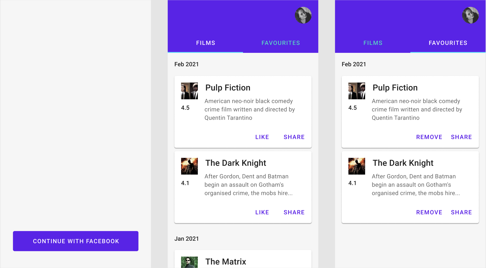

# android-test-task
Test Task for android candidates

Write the application that allows user to review the list of ongoing movies and add them to favorites. You should provide your solution as a link to public repository on any git hosting service you prefer: GitHub, GitLab, Bitbucket. Please make commits of logical units, so we can evaluate your progress and add comments as you see fit.

### Functional requirements:
- The main screen contains two tabs: All and Favorites.
- Tab All should display a list of ongoing movies with pagination.
- Tab Favorites should display a list of bookmarked movies
- User can add / remove movie to / from his favorites. All changes should be visible immediately on both tabs
- User can share movie info via any existing provider
- User can refresh movies list using pull-to-refresh.
- User can see early loaded content without internet connection (only 1st page, without pagination)

Screen UI should display one of the following states:
- Loading
- Refreshing
- Loading More (pagination)
- Error
- Content (just showing movies)

### Optional Requirements
- Implement sign-in with Facebook and show user avatar

### Technical requirements
- Kotlin is required
- Sqlite / Room is required
- MVP / MVVM / MVI architecture is required;
- Clean Architecture patterns are mandatory;
- Dependency injection is required;
- Unit-tests are mandatory;

### Notes
- Your code should be testable, scalable and flexible
- The most important parts of logic should be covered with unit tests (you are free to decide what parts)
- You are free to use any libraries
- You are free to implement your own design
- Some fancy animations will be a plus, but don't spend a lot of time for that
- Make sure that anyone can build your project.

### Design example
Here is an example how application might look like, but the final decision is up to you.

### Resources
The movies database API: https://www.themoviedb.org/documentation/api/discover 

Please, obtain your own API key.

Design example: https://www.figma.com/file/vpBc5bvJj6gmVBIqdrzn0V/boosters-test-task?node-id=0%3A1

## P.S.
Feel free to ask any question to your contacting HR

